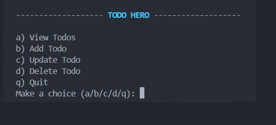

# TODO HERO


This is a command-line tool written in Ruby that is used for storing , viewing, update and delete todos. The data is manged in a text file.

## Features

- View all todos
- Add new todo
- Update a todo
- Delete a todo

## Prerequisites

- Ruby 3.0 or later

## Installation

1. Clone the repository:
   ```sh
   git clone https://github.com/rahul01-git/TODO-HERO.git
   cd port-peek
   ```

2. Run the project:
   ```sh
   ruby index.rb
   ```

## Example Output


